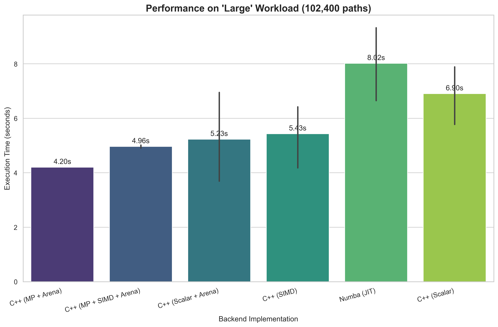

# LSM Performance Workbench

This project is a full-stack application and high-performance computing workbench designed to rigorously benchmark various hardware and software optimizations for pricing American options using the Longstaff-Schwartz Monte Carlo (LSM) algorithm.

It features a deeply optimized C++/Python backend engine and a modern, interactive React+TypeScript frontend that allows users to design, execute, and analyze complex performance experiments in real time. This tool serves as a practical demonstration of advanced performance engineering techniques in a quantitative finance context.



## Key Features

- **Multiple Backends:** Compare performance across eight distinct execution environments:
    - Pure Python (`numpy`)
    - Just-In-Time Compiled Python (`numba`)
    - C++ (Scalar, `std::vector`)
    - C++ (Scalar, Custom Arena Allocator)
    - C++ (SIMD / Vectorized `xsimd`)
    - C++ (Multithreaded, Scalar, Arena)
    - C++ (Ultimate: Multithreaded, SIMD, Arena)
- **Interactive Web UI:** A sophisticated frontend built with React & TypeScript provides a complete research workbench:
    - Full, granular control over all option and simulation parameters.
    - An advanced parameter sweep interface to run experiments across a range of values.
    - Live polling for the status of long-running, computationally intensive tasks.
    - Intelligent, conditional rendering of results as Bar Charts (for single runs) or Line Charts (for sweeps).
    - An essential "Download as CSV" feature for all generated data.
- **Robust API:** A FastAPI backend handles the C++ engine, using a background task queue to manage intensive jobs without blocking the user interface.

## Core Finding: Amdahl's Law and Hardware Contention

A key insight from this project is a powerful, real-world demonstration of the practical limits of optimization. While the "Ultimate" backend (combining Multithreading, SIMD, and Arena Allocation) is exceptionally fast, the **fastest backend on the largest workloads was the Multithreaded Scalar version with Arena Allocation (`cpp_mp`)**.

The `cpp_ultimate` backend, which added the heaviest SIMD instructions on top of the multithreaded workload, was consistently slightly slower than its scalar counterpart on the same number of threads. This is a classic example of **hardware resource contention**:
1.  **Memory Bandwidth Saturation:** All CPU cores attempting to execute data-hungry AVX instructions simultaneously can saturate the memory bus.
2.  **Thermal Throttling:** The extreme power draw and heat generated by running a full AVX workload across all cores likely forces the CPU to reduce its clock speed to stay within a safe thermal envelope, resulting in a net performance loss compared to the cooler-running scalar workload.

This result proves that simply combining all available optimizations does not guarantee the best performance; a deep understanding of the algorithm's interaction with the underlying hardware is critical.

## How to Run This Project

To run this application, you will need two separate terminal sessions. Please follow the setup instructions in **[REPRODUCE.md](REPRODUCE.md)** first.

### Terminal 1: Start the Backend API

```powershell
# Navigate to the project root directory
cd lsm-performance-suite

# Activate the Conda environment
conda activate quant_perf

# Set the required environment variable for OpenMP
$env:KMP_DUPLICATE_LIB_OK="TRUE"

# Start the API server
uvicorn api:app --reload
